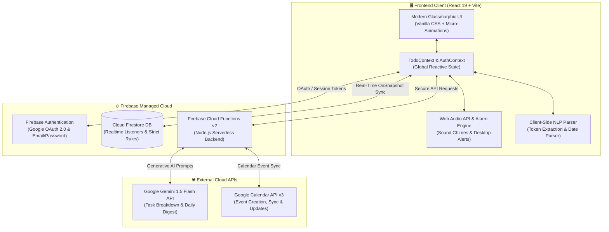

<div align="center">

# ✨ AuraTask AI
### *Intelligent Real-Time To-Do & Task Allocation Workspace*

[](https://react.dev/)
[](https://vitejs.dev/)
[](https://firebase.google.com/)
[](https://ai.google.dev/)
[](https://developers.google.com/calendar)
[](LICENSE)

<p align="center">
  <b>AuraTask AI</b> is a next-generation productivity hub that unites <b>real-time cloud synchronization</b>, <b>generative AI task intelligence</b>, <b>two-way Google Calendar scheduling</b>, and a <b>Todoist-inspired glassmorphic interface</b> into a fast, fluid, and delightful daily planning experience.
</p>

[✨ Live Demo](#-quick-start) • [⚡ Key Features](#-key-features) • [🏗️ Architecture](#️-system-architecture) • [🚀 Quick Start](#-quick-start) • [⚙️ Configuration](#️-environment--api-configuration) • [⌨️ NLP Cheat Sheet](#-natural-language-syntax-cheat-sheet)

---

</div>

## 📑 Table of Contents

- [🌟 Overview](#-overview)
- [⚡ Key Features](#-key-features)
  - [1. 🤖 Generative AI Task Intelligence](#1--generative-ai-task-intelligence)
  - [2. 📅 Two-Way Google Calendar Integration](#2--two-way-google-calendar-integration)
  - [3. 🔄 Real-Time Multi-Device Sync](#3--real-time-multi-device-sync)
  - [4. 📊 Multi-View Productivity Suite](#4--multi-view-productivity-suite)
  - [5. 🔔 Live Alarm, Sound Synthesis & Smart Reminders](#5--live-alarm-sound-synthesis--smart-reminders)
  - [6. 🛡️ Enterprise-Grade Multi-User Security](#6--enterprise-grade-multi-user-security)
- [🏗️ System Architecture](#️-system-architecture)
- [🛠️ Tech Stack](#️-tech-stack)
- [📁 Directory Structure](#-directory-structure)
- [🚀 Quick Start & Local Setup](#-quick-start--local-setup)
- [⚙️ Environment & API Configuration](#️-environment--api-configuration)
  - [Firebase Setup](#firebase-configuration)
  - [Google Calendar & OAuth 2.0](#google-cloud--calendar-api-setup)
  - [Google Gemini API](#google-gemini-api)
- [⌨️ Natural Language Syntax Cheat Sheet](#-natural-language-syntax-cheat-sheet)
- [🔒 Security & Firestore Rules](#-security--firestore-rules)
- [🤝 Contributing](#-contributing)
- [📄 License](#-license)

---

## 🌟 Overview

Modern productivity tools are often either too simplistic or overwhelmed with rigid enterprise overhead. **AuraTask AI** bridges this gap by blending conversational intelligence with ultra-fast real-time task management:

- **Type Naturally**: Create complex scheduled tasks in plain English (e.g., *"Schedule team retro this Friday at 3:30pm !high #engineering"*).
- **Time-Block Automatically**: Allocate tasks onto your Google Calendar with one click.
- **Stay in Flow**: Enjoy frictionless views ranging from a clean List to an interactive Kanban Board, 7-Day Timeline, and Analytics Dashboard.
- **Real-Time by Default**: Every edit, drag-and-drop reorder, or completion updates instantly across all your open tabs and devices with zero manual refreshing.

---

## ⚡ Key Features

### 1. 🤖 Generative AI Task Intelligence
- **AI Task Allocation Drawer**: Conversational assistant powered by Google Gemini to analyze your goals, suggest time blocks, and allocate tasks directly into your workflow.
- **Natural Language Parsing**: Instant extraction of task title, due date, start time, priority level, and tags directly from free-form text.
- **Automated Subtask Breakdown**: Deconstruct large, ambiguous tasks (e.g., *"Prepare Q3 Product Launch"*) into bite-sized actionable checklists with a single click.
- **AI Morning Daily Digest**: Daily executive summary highlighting today's critical path, overdue risks, and suggested priority order.

### 2. 📅 Two-Way Google Calendar Integration
- **1-Click OAuth 2.0 Authorization**: Secure Google account connection with granular calendar permissions.
- **Instant Event Sync**: Tasks scheduled with specific times can be automatically synced or manually published to your primary Google Calendar.
- **Deep Linking**: Direct `gcalLink` integration to jump straight to the event in Google Calendar web or mobile.
- **Persistent Event ID Tracking**: Keeps task updates, reschedules, and deletions synced between AuraTask and Google Calendar.

### 3. 🔄 Real-Time Multi-Device Sync
- **Firebase Firestore Reactive Listeners**: Sub-millisecond state propagation across tabs, laptops, and mobile browsers.
- **Offline Resilience & Optimistic Updates**: Smooth local state updates with background synchronization.
- **Multi-Tab Safety**: Live updates prevent race conditions and outdated state when switching between screens.

### 4. 📊 Multi-View Productivity Suite
- **Interactive Task List**: Drag-and-drop reordering, inline editing, subtask progress meters, and celebratory confetti animations upon completion.
- **Kanban Board**: Drag tasks across `Todo`, `In-Progress`, and `Done` swimlanes.
- **Upcoming Timeline View**: 7-day visual agenda with hourly time blocks, overdue banners, and quick reschedule actions.
- **Filters & Labels Hub**: Filter effortlessly by custom tags (`#work`, `#personal`, `#deep-work`), priority levels (`!high`, `!medium`, `!low`), or completion status.
- **Reporting & Analytics Dashboard**: Live metrics tracking completion velocity, daily streaks, productivity scores, and categorized workload charts.

### 5. 🔔 Live Alarm, Sound Synthesis & Smart Reminders
- **Web Audio Synthesis**: Built-in harmonic audio chime alerts that ring when a task is due, without relying on external MP3 assets.
- **Browser Push Notifications**: Desktop Web Notifications alert you in advance of approaching deadlines.
- **Unfinished Task Reschedule Modal**: Smart prompt on startup to batch-reschedule or archive overdue tasks from previous days.

### 6. 🛡️ Enterprise-Grade Multi-User Security
- **Dual Auth Modes**: One-click Google Sign-In (OAuth 2.0) and Email/Password authentication with verification.
- **Strict Firestore Security Rules**: Enforces complete tenant isolation (`resource.data.userId == request.auth.uid`).
- **Zero Client Secret Exposure**: Serverless Cloud Functions handle privileged Google Gemini and Calendar API operations securely.

---

## 🏗️ System Architecture



---

## 🛠️ Tech Stack

| Category | Technology | Description |
|---|---|---|
| **Frontend Framework** | [React 19](https://react.dev/) | Modern concurrent UI architecture with Hooks & Context |
| **Build Tool** | [Vite 6](https://vitejs.dev/) | Lightning-fast HMR and optimized production bundling |
| **Styling & Design** | Vanilla CSS3 | Custom Aurora glassmorphic design system, CSS variables & fluid animations |
| **Database & Auth** | [Firebase Firestore](https://firebase.google.com/docs/firestore) & [Auth](https://firebase.google.com/docs/auth) | Real-time NoSQL database, OAuth 2.0, and security rules |
| **Serverless Backend** | [Firebase Cloud Functions v2](https://firebase.google.com/docs/functions) | Node.js backend microservices for AI & Calendar synchronization |
| **Artificial Intelligence** | [Google Gemini 1.5 Flash](https://ai.google.dev/) | Natural language parsing, intelligent breakdown & daily briefings |
| **Calendar Sync** | [Google Calendar API v3](https://developers.google.com/calendar) | Live time-blocking and automated event allocation |
| **Icons & Effects** | [Lucide React](https://lucide.dev/) & [Canvas Confetti](https://www.npmjs.com/package/canvas-confetti) | Clean modern iconography and celebration visual effects |

---

## 📁 Directory Structure

```text
To-Do/
├── .env.example                # Template for Firebase & API environment keys
├── firebase.json               # Firebase Hosting and Cloud Functions configuration
├── firestore.rules             # Granular database security rules per user
├── firestore.indexes.json      # Firestore composite index definitions
├── index.html                  # HTML entry point with modern typography
├── package.json                # Project dependencies & scripts
├── vite.config.js              # Vite bundler configuration
│
├── functions/                  # Firebase Cloud Functions (Serverless Backend)
│   ├── index.js                # Gemini NLP, Daily Digest & Google Calendar endpoints
│   └── package.json            # Backend dependencies (@google/generative-ai, googleapis)
│
└── src/                        # Frontend Application Source Code
    ├── main.jsx                # Application root mount point
    ├── App.jsx                 # Main layout coordinator & view switcher
    ├── index.css               # Complete Glassmorphic Aurora Design System
    │
    ├── components/             # Reusable UI & Feature Components
    │   ├── AIAssistantDrawer.jsx         # Conversational AI Task & Schedule Assistant
    │   ├── AIDailyDigest.jsx             # Morning briefing & workload focus widget
    │   ├── AnimatedBackground.jsx        # Ambient glowing aurora canvas background
    │   ├── AuthScreen.jsx                # Multi-user login & registration screen
    │   ├── FiltersAndLabelsView.jsx      # Tag & priority filtered task views
    │   ├── GoogleOAuthModal.jsx          # Interactive Google Calendar consent modal
    │   ├── Header.jsx                    # Top navbar with live digital clock & AI trigger
    │   ├── KanbanBoardView.jsx           # Drag-and-drop Kanban workflow columns
    │   ├── LiveClock.jsx                 # Real-time ticking digital clock widget
    │   ├── NaturalLanguageInput.jsx      # Smart task bar with live syntax parser
    │   ├── OnboardingModal.jsx           # Guided first-time user tour
    │   ├── ReportingAnalyticsDashboard.jsx # Productivity scores, streaks & charts
    │   ├── SettingsModal.jsx             # User preferences, alarms, themes & account
    │   ├── SetupChecklistWidget.jsx      # Floating setup onboarding progress tracker
    │   ├── Sidebar.jsx                   # Todoist-inspired collapsible navigation
    │   ├── TaskCard.jsx                  # Individual task card with drag, subtasks & sync
    │   ├── TaskDetailPanel.jsx           # Slide-in comprehensive task editor panel
    │   ├── TaskFilterBar.jsx             # Quick status & priority toggle bar
    │   ├── TaskListView.jsx              # Standard task list with bulk actions
    │   ├── Toast.jsx                     # Non-intrusive feedback toast notifications
    │   ├── UnfinishedRescheduleModal.jsx # Overdue task catch-up & reschedule modal
    │   └── UpcomingTimelineView.jsx      # 7-day visual calendar timeline agenda
    │
    ├── config/                 # Service Configurations
    │   └── firebase.js         # Firebase client initialization & fallback config
    │
    ├── context/                # Global State Management
    │   ├── AuthContext.jsx     # Authentication state, session handling & profile
    │   └── TodoContext.jsx     # Tasks state, Firestore sync, filters & active view
    │
    ├── services/               # Core Integration Services
    │   ├── emailReminderService.js # Email alert triggers & notification templates
    │   ├── firebaseDb.js           # Firestore CRUD queries & live collection listeners
    │   ├── googleCalendar.js       # Google Calendar API REST calls & URL generator
    │   └── liveAlarmService.js     # Web Audio API chime synthesis & Web Push alerts
    │
    └── utils/                  # Helper Utilities
        ├── aiHelpers.js        # AI prompt generators & heuristic breakdown fallback
        ├── dateUtils.js        # Date formatting, relative dates & time helpers
        ├── nlpParser.js        # Natural language regex token extraction
        └── storage.js          # Local preferences & session storage utilities
```

---

## 🚀 Quick Start & Local Setup

### Prerequisites
- [Node.js](https://nodejs.org/) (version `18.0.0` or higher)
- [npm](https://www.npmjs.com/) or [yarn](https://yarnpkg.com/)
- A free [Firebase Project](https://console.firebase.google.com/) for cloud database & authentication

### 1. Clone the Repository
```bash
git clone https://github.com/Kaveesha-V/Todo-List.git
cd Todo-List
```

### 2. Install Dependencies
```bash
npm install
```

### 3. Configure Environment Variables
Create a `.env` file in the root directory by copying the example template:
```bash
cp .env.example .env
```
Fill in your Firebase and optional Google API keys (see [Configuration Guide](#️-environment--api-configuration)).

### 4. Start Development Server
```bash
npm run dev
```
Open your browser and navigate to `http://localhost:5173`.

### 5. Build for Production
```bash
npm run build
```
Preview the production build locally:
```bash
npm run preview
```

---

## ⚙️ Environment & API Configuration

### Firebase Configuration
1. Navigate to the [Firebase Console](https://console.firebase.google.com/) and create a new project.
2. Under **Build > Authentication**, enable **Google** and **Email/Password** sign-in methods.
3. Under **Build > Firestore Database**, create a database in production mode.
4. Under **Project Settings > General > Your Apps**, register a Web App (`</>`) and copy the config credentials into your `.env`:

```env
# Firebase Configuration
VITE_FIREBASE_API_KEY=your_firebase_api_key
VITE_FIREBASE_AUTH_DOMAIN=your_project_id.firebaseapp.com
VITE_FIREBASE_PROJECT_ID=your_project_id
VITE_FIREBASE_STORAGE_BUCKET=your_project_id.firebasestorage.app
VITE_FIREBASE_MESSAGING_SENDER_ID=your_messaging_sender_id
VITE_FIREBASE_APP_ID=your_app_id

# Optional: Google Gemini API Key
VITE_GEMINI_API_KEY=your_gemini_api_key
```

### Google Cloud & Calendar API Setup
To enable Google Calendar synchronization:
1. In the [Google Cloud Console](https://console.cloud.google.com/), select your Firebase project.
2. Go to **APIs & Services > Library** and enable:
   - **Google Calendar API**
   - **Generative Language API** (for Gemini)
3. Under **APIs & Services > Credentials**, create an **OAuth 2.0 Client ID** (Web application).
4. Add your development URL (`http://localhost:5173`) and production domain to **Authorized JavaScript origins** and **Authorized redirect URIs**.

### Cloud Functions Deployment (Optional Backend)
To deploy the serverless Gemini AI and Calendar sync microservices:
```bash
cd functions
npm install
cd ..
firebase deploy --only functions
```

---

## ⌨️ Natural Language Syntax Cheat Sheet

When creating tasks in the smart input bar or via the AI Assistant, you can use natural language tokens:

| Token / Pattern | Example | Parsed Result |
|---|---|---|
| **Relative Days** | `tomorrow at 3pm`, `today 10am`, `tonight 8pm` | Automatically sets target due date & time |
| **Specific Days** | `next Monday 9:00`, `this Friday at 4:30pm` | Calculates nearest calendar date and sets time |
| **Priority Tags** | `!high`, `!medium`, `!low`, `!urgent` | Assigns task priority level |
| **Categorization** | `#work`, `#study`, `#personal`, `#health` | Attaches categorization tags |
| **Subtask Prompt** | `break down Plan trip to Tokyo` | Generates full checklist of subtasks |
| **Combined Syntax** | `Deliver client deck tomorrow at 2pm !high #work` | Title: *Deliver client deck*<br>Due: *Tomorrow 14:00*<br>Priority: *High*<br>Tags: *work* |

---

## 🔒 Security & Firestore Rules

AuraTask AI implements zero-trust data isolation. No user can read or write another user's tasks:

```javascript
rules_version = '2';
service cloud.firestore {
  match /databases/{database}/documents {
    
    // Per-User Task Security
    match /tasks/{taskId} {
      allow read, update, delete: if request.auth != null && resource.data.userId == request.auth.uid;
      allow create: if request.auth != null && request.resource.data.userId == request.auth.uid;
    }

    // User Profile Security
    match /users/{userId} {
      allow read, write: if request.auth != null && request.auth.uid == userId;
    }
  }
}
```

---

## 🤝 Contributing

Contributions, feature suggestions, and bug reports are welcome!

1. Fork the Project (`https://github.com/Kaveesha-V/Todo-List/fork`)
2. Create your Feature Branch (`git checkout -b feature/AmazingFeature`)
3. Commit your Changes (`git commit -m 'feat: Add some AmazingFeature'`)
4. Push to the Branch (`git push origin feature/AmazingFeature`)
5. Open a Pull Request

---

## 📄 License

Distributed under the **MIT License**. See `LICENSE` for more information.

---

<div align="center">
  <sub>Built with ❤️ using React 19, Firebase, Google Gemini, and modern web technologies.</sub>
</div>
